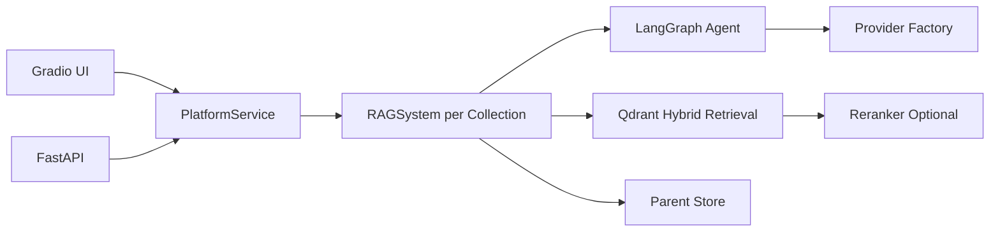

# Agentic RAG Platform Documentation

An **Agentic Retrieval-Augmented Generation (RAG)** platform built with **LangGraph**, **FastAPI**, **Qdrant hybrid retrieval**, a configurable **reranker**, optional **LightRAG** integration, and an evaluation layer that can export benchmark results and markdown reports.

## Table of Contents

[Quick Start](#quick-start) | [Architecture Overview](#architecture-overview) | [API](#api) | [Project Structure](#project-structure) | [Configuration Guide](#configuration-guide) | [Troubleshooting](#troubleshooting)

---

## Quick Start

### Installation

```bash
pip install -r requirements.txt
```

If you want to use OpenAI as the cloud provider:

```bash
pip install langchain-openai
```

If you want to use Google Gemini as the cloud provider:

```bash
pip install langchain-google-genai
```

If you want to use the local filesystem MCP server:

```bash
pip install "mcp[cli]"
```

### Prerequisites

- Python 3.10+
- Ollama, OpenAI, or Google Gemini credentials
- A running Ollama server if `LLM_PROVIDER=ollama`

### Environment

Copy the example environment file:

```bash
cp project/.env.example project/.env
```

### Run the Gradio demo

```bash
python project/app.py
```

The UI will be available at `http://127.0.0.1:7860`.

### Run the FastAPI server

```bash
python project/api_server.py
```

The API will be available at `http://127.0.0.1:8000`.

> Note: the current week-1 baseline still uses embedded local Qdrant (`QdrantClient(path=...)`), so run Gradio or FastAPI as a single active process against the same project data directory. Running both at the same time may trigger a local storage lock.

### Run the filesystem MCP server

```bash
cd project
python mcp_servers/filesystem_server.py
```

Default transport is `stdio`. The server is restricted to the current repository roots configured by `MCP_FILESYSTEM_ALLOWED_ROOTS`.

### Run the filesystem MCP smoke test

```bash
python project/mcp_servers/smoke_test.py
```

### MCP-backed file questions

Once the app is running, the agent can now use filesystem MCP tools for repository-local questions such as:

- `看看 project/evaluation/reports 目录里有哪些文件`
- `读取 public_light_pollution_retrieval_compare.md 并总结`
- `在 README.md 里搜索 Phoenix 配置`

### Install evaluation dependencies

```bash
pip install -r requirements-eval.txt
```

### Run the benchmark

```bash
python project/evaluation/run_benchmark.py \
  --dataset project/evaluation/datasets/sample_eval.jsonl \
  --mode baseline_hybrid \
  --mode hybrid_rerank
```

### Generate a markdown report

```bash
python project/evaluation/generate_report.py \
  project/evaluation/reports/benchmark_baseline_hybrid_*.json \
  project/evaluation/reports/benchmark_hybrid_rerank_*.json \
  --output project/evaluation/reports/benchmark_report.md
```

### Sync a collection into LightRAG

```bash
python project/lightrag_sync.py --collection public_light_pollution_corpus --clear-first
```

### Run answer benchmark with LightRAG

```bash
python project/evaluation/run_light_answer_benchmark.py \
  --dataset project/evaluation/datasets/public_light_pollution_answer_eval_mini.jsonl \
  --mode baseline_hybrid \
  --mode lightrag
```

---

## Architecture Overview

### What changed from the original demo

- Gradio callbacks now call a shared `PlatformService`
- FastAPI exposes the same ingestion/chat flows over HTTP
- LLM creation is routed through a provider factory
- Knowledge bases are isolated by `collection`
- Logging is emitted as structured JSON-style events
- Retrieval can switch between `baseline_hybrid` and `hybrid_rerank`
- Chat can optionally route to an external LightRAG server when `RETRIEVAL_MODE=lightrag`
- Agent Skills inject reusable workflows such as Chinese-over-English paper QA, literature comparison, ingestion guidance, evaluation, and trace debugging
- Self-RAG reflection can inspect draft answers for missing evidence and trigger one focused follow-up retrieval
- Planner-Worker fan-out assigns roles such as method, data/evaluation, overview, comparison, and limitation workers
- Optional model routing can choose small or large Ollama models based on skill, complexity, and reflection settings
- FastAPI exposes `/chat/stream` for SSE agent event streaming
- Optional CRAG web-search fallback can be registered as an agent tool for out-of-knowledge-base questions
- CLIP-based multimodal figure retrieval indexes PDF page screenshots and embedded images for figure/table/diagram questions
- Benchmark runs can export JSON results and markdown comparison reports, including Ragas and LLM-as-Judge scoring

### System flow



### Retrieval flow

```text
Upload PDF/Markdown
  -> Markdown conversion
  -> optional PDF figure/page screenshot extraction
  -> Parent chunking
  -> Child chunking
  -> Qdrant hybrid indexing
  -> optional CLIP image indexing in a separate Qdrant figure collection

Chat request
  -> greeting check
  -> optional Agent Skill selection
  -> optional model route decision
  -> optional LightRAG REST query when RETRIEVAL_MODE=lightrag
  -> query rewrite
  -> planner-worker task assignment
  -> optional search_figures for figure/table/diagram/plot questions
  -> search_child_chunks
  -> rerank top candidates (optional)
  -> retrieve_parent_chunks
  -> optional Self-RAG reflection and focused follow-up retrieval
  -> optional CRAG web_search tool when external evidence is needed
  -> aggregation

Benchmark run
  -> dataset jsonl
  -> baseline_hybrid / hybrid_rerank
  -> latency capture
  -> optional Ragas scoring
  -> optional LLM-as-Judge domain scoring
  -> JSON report
  -> Markdown summary
```

---

## API

### Endpoints

- `GET /health`
- `GET /collections`
- `GET /skills`
- `POST /ingest`
- `POST /chat`
- `POST /chat/stream`
- `POST /figures/search`
- `POST /reset`

### Example: health

```bash
curl http://127.0.0.1:8000/health
```

### Example: chat

```bash
curl -X POST http://127.0.0.1:8000/chat \
  -H "Content-Type: application/json" \
  -d '{
    "collection": "default",
    "message": "Summarize the uploaded document",
    "session_id": "demo-session-1"
  }'
```

### Example: SSE stream

`/chat/stream` returns Server-Sent Events. It streams agent-level events such as skill selection, model routing, worker start, reflection start, final answer chunks, and done/error events.

```bash
curl -N -X POST http://127.0.0.1:8000/chat/stream \
  -H "Content-Type: application/json" \
  -d '{
    "collection": "paper_test",
    "message": "这篇论文的创新点是什么？"
  }'
```

Typical event names:

```text
skill_selected
model_routed
retrieval_started
worker_started
reflection_started
answer_started
answer_delta
done
error
```

### Example: force a skill

```bash
curl -X POST http://127.0.0.1:8000/chat \
  -H "Content-Type: application/json" \
  -d '{
    "collection": "public_light_pollution_corpus",
    "skill_name": "paper_qa_zh",
    "message": "这篇论文把 artificial light at night 解释成污染物的核心依据是什么？"
  }'
```

You can also invoke a skill directly in the message:

```text
/paper_qa_zh 这篇论文的实验指标和局限是什么？
```

### Example: ingest

```bash
curl -X POST "http://127.0.0.1:8000/ingest?collection=default" \
  -F "files=@/path/to/file.pdf"
```

---

## Project Structure

### Entry Point & Configuration

| File | Purpose |
|------|---------|
| `project/app.py` | Gradio entry point |
| `project/api_server.py` | FastAPI entry point |
| `project/config.py` | Central runtime and provider configuration |
| `project/utils.py` | PDF to Markdown conversion and context token estimation |
| `project/document_chunker.py` | Parent/child splitting logic with cleaning and merging rules |
| `project/Dockerfile` | Dockerfile with Ollama for local deployment |

### Service & Provider Layer

| File | Purpose |
|------|---------|
| `project/services/platform_service.py` | Shared service layer for Gradio and FastAPI |
| `project/core/skill_registry.py` | Filesystem-backed Agent Skills discovery, direct invocation, and heuristic routing |
| `project/providers/factory.py` | LLM provider factory (Ollama/OpenAI) |
| `project/api/app.py` | FastAPI routes |
| `project/api/schemas.py` | Request/response models |
| `project/retrieval/pipeline.py` | Retrieval pipeline with optional reranking |
| `project/retrieval/reranker.py` | CrossEncoder reranker wrapper |
| `project/lightrag_sync.py` | Sync an existing markdown collection into LightRAG via REST |
| `project/multimodal/clip_figure_index.py` | CLIP-backed PDF figure/page screenshot extraction, indexing, and search |

### Core System

| File | Purpose |
|------|---------|
| `project/core/rag_system.py` | Collection-aware RAG bootstrap and graph compilation |
| `project/core/document_manager.py` | Collection-aware document ingestion pipeline |
| `project/core/observability.py` | Optional Langfuse tracing |
| `project/core/tracing.py` | Phoenix/OpenTelemetry tracing helpers |
| `project/core/lightrag_client.py` | REST client for external LightRAG server |
| `project/core/logging_utils.py` | Structured logging helpers |
| `project/core/greetings.py` | Friendly greeting detection and UX fallback |

### MCP

| File | Purpose |
|------|---------|
| `project/mcp_servers/filesystem_server.py` | Restricted filesystem MCP server for repo-local file listing, reading, and text search |
| `project/mcp_servers/smoke_test.py` | Local stdio smoke test for MCP tool calls |

### Evaluation

| File | Purpose |
|------|---------|
| `project/evaluation/run_benchmark.py` | CLI to run baseline vs rerank benchmark |
| `project/evaluation/generate_report.py` | CLI to generate markdown summary from JSON outputs |
| `project/evaluation/runner.py` | Benchmark execution, latency collection, optional Ragas hook |
| `project/evaluation/report.py` | Markdown report rendering |
| `project/evaluation/datasets/sample_eval.jsonl` | Starter benchmark dataset template |

### Database Layer

| File | Purpose |
|------|---------|
| `project/db/vector_db_manager.py` | Shared Qdrant client wrapper with collection helpers |
| `project/db/parent_store_manager.py` | File-backed parent chunk storage per collection |

### RAG Agent (LangGraph)

| File | Purpose |
|------|---------|
| `project/rag_agent/graph.py` | Graph builder and compilation logic |
| `project/rag_agent/graph_state.py` | Shared and per-agent graph state definitions and answer accumulation/reset logic|
| `project/rag_agent/nodes.py` | Node implementations (summarize, rewrite, agent execution, aggregate) |
| `project/rag_agent/edges.py` | Conditional edge routing logic (e.g., routing based on query clarity) |
| `project/rag_agent/tools.py` | Retrieval tools (`search_child_chunks`, `retrieve_parent_chunks`) |
| `project/rag_agent/prompts.py` | System prompts for agent behavior |
| `project/rag_agent/schemas.py` | Structured output schemas (Pydantic models) |

### Agent Skills

| Skill | Purpose |
|------|---------|
| `project/skills/paper_qa_zh/SKILL.md` | Chinese questions over English academic papers with bilingual query rewriting and Chinese grounded answers |
| `project/skills/literature_compare/SKILL.md` | Multi-paper comparison across methods, datasets, metrics, limitations, and use cases |
| `project/skills/rag_ingest/SKILL.md` | Document ingestion workflow guidance for PDF/Markdown conversion, chunking, indexing, and collection isolation |
| `project/skills/rag_eval/SKILL.md` | Evaluation workflow for retrieval/answer benchmarks, Ragas, latency, MRR, and failure cases |
| `project/skills/trace_debug/SKILL.md` | Phoenix/Langfuse trace and report debugging workflow |

### User Interface

| File | Purpose |
|------|---------|
| `project/ui/css.py` | Custom CSS styling for the Gradio interface |
| `project/ui/gradio_app.py` | Gradio UI implementation with document upload and chat |

---

## Configuration Guide

All primary settings are in `project/config.py`. Key parameters:

### Directory Configuration

```python
MARKDOWN_ROOT_DIR = "markdown_docs"   # Root directory; each collection gets its own subfolder
PARENT_STORE_ROOT = "parent_store"    # Parent chunks are stored per collection
QDRANT_DB_PATH = "qdrant_db"          # Shared local Qdrant database path
```

### Collection Configuration

```python
DEFAULT_COLLECTION = "default"
COLLECTION_PREFIX = "document_child_chunks"

# Helpers
get_vector_collection_name("customer-a")
get_markdown_dir("customer-a")
get_parent_store_path("customer-a")
```

### Model Configuration

```python
LLM_PROVIDER = "ollama"  # or "openai" or "google"
DENSE_MODEL = "sentence-transformers/all-mpnet-base-v2"
SPARSE_MODEL = "Qdrant/bm25"
LLM_MODEL = "qwen3:14b"
LLM_TEMPERATURE = 0  # 0 = deterministic, 1 = creative
```

Google Gemini example:

```env
LLM_PROVIDER=google
LLM_MODEL=gemini-2.5-flash
GOOGLE_API_KEY=your-google-api-key
```

### Retrieval & Evaluation Configuration

```python
RETRIEVAL_MODE = "baseline_hybrid"  # or "hybrid_rerank" or "lightrag"
SIMILARITY_SCORE_THRESHOLD = 0.7
RERANKER_ENABLED = True
RERANKER_MODEL = "BAAI/bge-reranker-base"
RERANK_CANDIDATE_MULTIPLIER = 4
RERANK_MAX_CANDIDATES = 20

EVAL_OUTPUT_DIR = "project/evaluation/reports"
EVAL_DEFAULT_DATASET = "project/evaluation/datasets/sample_eval.jsonl"
```

`sample_eval.jsonl` is intentionally a template. Fill in `ground_truth` with your own standard answers to enable meaningful Ragas scoring.

The agentic feature benchmark also supports domain-specific LLM-as-Judge scoring. Each judged case is evaluated with the question, answer, ground truth, and retrieved contexts across method accuracy, dataset completeness, metric correctness, evidence grounding, Chinese clarity, and overall quality.

### LightRAG Configuration

```python
LIGHTRAG_ENABLED = True
LIGHTRAG_BASE_URL = "http://127.0.0.1:9621"
LIGHTRAG_QUERY_MODE = "mix"
LIGHTRAG_TIMEOUT_SECONDS = 180
LIGHTRAG_TOP_K = 10
LIGHTRAG_CHUNK_TOP_K = 10
```

If `RETRIEVAL_MODE=lightrag`, the shared `PlatformService` sends chat requests to the external LightRAG server instead of the local LangGraph retrieval pipeline.

### Agent Configuration
```python
# Agent Skills
SKILLS_ENABLED = True
SKILLS_DIR = "project/skills"

# Reflection and planner-worker fan-out
REFLECTION_ENABLED = True
MAX_REFLECTION_ROUNDS = 1
MIN_EVIDENCE_SCORE = 0.7
MULTI_AGENT_PLANNER_ENABLED = True

# Optional cost-aware model routing
MODEL_ROUTER_ENABLED = False
SMALL_LLM_MODEL = "qwen2.5:1.5b"
LARGE_LLM_MODEL = "qwen3:14b"

# Optional CRAG web-search fallback
CRAG_ENABLED = False
CRAG_PROVIDER = "tavily"  # or "serper"
CRAG_MAX_RESULTS = 5
CRAG_SEARCH_DEPTH = "basic"
CRAG_TIMEOUT_SECONDS = 20

# Hard limits to prevent infinite loops
MAX_TOOL_CALLS = 8       # Maximum tool calls per agent run
MAX_ITERATIONS = 10      # Maximum agent loop iterations
GRAPH_RECURSION_LIMIT = 50 # Maximum number of steps before hitting a stop condition

# Context compression thresholds
BASE_TOKEN_THRESHOLD = 2000     # Initial token threshold for compression
TOKEN_GROWTH_FACTOR = 0.9       # Multiplier applied after each compression
```

When `CRAG_ENABLED=true`, the agent registers a `web_search` tool. The tool is intended for out-of-knowledge-base, latest, public-web, price, official-site, or low-local-evidence questions. It is disabled by default so paper QA stays grounded in the local collection unless you explicitly enable web fallback.

### Multimodal Figure Retrieval

```python
MULTIMODAL_ENABLED = True
CLIP_MODEL = "clip-ViT-B-32"
FIGURE_INDEX_PAGE_SCREENSHOTS = True
FIGURE_INDEX_EMBEDDED_IMAGES = True
FIGURE_PAGE_RENDER_DPI = 120
FIGURE_MAX_PAGES_PER_DOC = 60
FIGURE_MAX_IMAGE_PIXELS = 12000000
```

When enabled, PDF ingestion extracts page screenshots and embedded images into `project/figure_store/<collection>/...`, embeds them with CLIP, and stores them in a separate Qdrant collection named `document_figures_<collection>`. The agent registers a `search_figures` tool for questions about figures, tables, architecture diagrams, plots, curves, and captions. FastAPI also serves extracted images under `/figures/files/...`.

Direct search test:

```bash
curl -s -X POST http://127.0.0.1:8000/figures/search \
  -H "Content-Type: application/json" \
  -d '{"collection":"paper_test","query":"architecture diagram cloud segmentation model","limit":3}' | python -m json.tool
```

### PDF Parsing Configuration

```python
PDF_PARSE_MODE = "auto"         # auto | layout | fast
PDF_FAST_PARSE_FILE_MB = 20     # auto mode uses fast parsing above this file size
PDF_FAST_PARSE_IMAGE_COUNT = 30 # auto mode uses fast parsing above this image count
```

Use `layout` when Markdown table/section structure matters more than speed. Use `fast` for quick paper ingestion when plain extracted text is enough for retrieval.

### Text Splitter Configuration

```python
CHILD_CHUNK_SIZE = 500              # Size of chunks used for retrieval
CHILD_CHUNK_OVERLAP = 100           # Overlap between chunks (prevents context loss)
MIN_PARENT_SIZE = 2000              # Minimum parent chunk size
MAX_PARENT_SIZE = 4000             # Maximum parent chunk size

# Markdown header splitting strategy
HEADERS_TO_SPLIT_ON = [
    ("#", "H1"),
    ("##", "H2"),
    ("###", "H3")
]
```

### Langfuse Observability (Optional)

```python
LANGFUSE_ENABLED = False               # Set to True via LANGFUSE_ENABLED env var
LANGFUSE_PUBLIC_KEY = ""               # From your Langfuse project settings
LANGFUSE_SECRET_KEY = ""               # From your Langfuse project settings
LANGFUSE_BASE_URL = "http://localhost:3000"  # Langfuse Cloud or self-hosted URL
```

---

## Common Customizations

### 1. Switching LLM Provider

> **Performance Note:** LLMs with 7B+ parameters typically offer superior reasoning, context comprehension, and response quality compared to smaller models. This applies to both proprietary and open-source models, as long as they support native tool/function calling.

The current platform routes model construction through `project/providers/factory.py`, so switching providers is configuration-driven.

#### Ollama

```bash
export LLM_PROVIDER=ollama
export LLM_MODEL=qwen3:14b
python project/app.py
```

#### OpenAI

```bash
pip install langchain-openai

export LLM_PROVIDER=openai
export OPENAI_API_KEY="your-openai-key"
export LLM_MODEL=gpt-4o-mini
python project/api_server.py
```

#### Local vLLM

Use this when a PaperAgentLM/LoRA-merged model is served through the vLLM OpenAI-compatible API.

```bash
pip install langchain-openai

export LLM_PROVIDER=local-vllm
export LOCAL_VLLM_BASE_URL=http://localhost:8001/v1
export LOCAL_VLLM_API_KEY=dummy
export LLM_MODEL=/home/suity/worksapce/PycharmProjects/FindJob/llm-alignment-deploy/model_store/paperagentlm-qwen2.5-1.5b-merged
python project/api_server.py
```

Supported out of the box:

| Provider | Required Package | Required Environment |
|----------|------------------|----------------------|
| Ollama | `langchain-ollama` | optional `OLLAMA_BASE_URL` |
| OpenAI | `langchain-openai` | `OPENAI_API_KEY` |
| Local vLLM | `langchain-openai` | `LOCAL_VLLM_BASE_URL`, `LOCAL_VLLM_API_KEY=dummy` |

### 2. Multi-Collection Isolation

Each knowledge base is isolated by:

- Qdrant vector collection name
- Markdown storage directory
- Parent chunk storage directory

Example helpers from `config.py`:

```python
get_vector_collection_name("customer-a")
get_markdown_dir("customer-a")
get_parent_store_path("customer-a")
```

Use different collections from:

- Gradio collection inputs
- `POST /ingest?collection=...`
- `POST /chat` request bodies

### 3. Changing Embedding Models

**Why change?** Trade-offs between speed, cost, and quality.

**Step 1:** Update `project/config.py`

```python
# Example: Faster, smaller model
DENSE_MODEL = "sentence-transformers/all-MiniLM-L6-v2"

# Example: Higher quality, slower model
# DENSE_MODEL = "sentence-transformers/all-mpnet-base-v2"

# Example: Gemma embeddings (Google's open model)
# DENSE_MODEL = "google/embeddinggemma-300m"

# Example: Qwen embeddings (Alibaba's multilingual model)
# DENSE_MODEL = "Qwen/Qwen3-Embedding-8B"

SPARSE_MODEL = "Qdrant/bm25"  # Usually no need to change
```

**Step 2:** Re-index your documents

⚠️ **Important:** Changing embeddings requires re-indexing all documents through the Gradio UI.

**Implementation Details** (in `project/db/vector_db_manager.py`):

```python
from langchain_huggingface import HuggingFaceEmbeddings
from langchain_qdrant import FastEmbedSparse
import config

self.__dense_embeddings = HuggingFaceEmbeddings(model_name=config.DENSE_MODEL)
self.__sparse_embeddings = FastEmbedSparse(model_name=config.SPARSE_MODEL)
```

**Popular Embedding Models:**

| Model | Context Size | Vector Dimension | Speed | Quality | Use Case |
|-------|--------------|------------------|-------|---------|----------|
| all-MiniLM-L6-v2 | 256 tokens | 384 | Fast | Good | General purpose, quick semantic similarity |
| all-mpnet-base-v2 | 512 tokens | 768 | Medium | Excellent | High-accuracy semantic search |
| bge-large-en-v1.5 | 512 tokens | 1024 | Slow | Best | Production-grade retrieval on GPU |
| google/embeddinggemma-300m | 2048 tokens | 768 | Fast | Very Good | Lightweight, efficient multilingual retrieval |
| Qwen/Qwen3-Embedding-8B | 32768 tokens | 4096 | Slow | Excellent / SOTA | Large-scale multilingual embeddings, long-context RAG |

---

### 4. Adjusting Chunking Strategy

**Why adjust?** Balance between retrieval precision and context richness.

> **💡 Validation Tool:** To avoid trial-and-error, you can use 🐿️[**Chunky**](https://github.com/GiovanniPasq/chunky) to visually inspect how different strategies affect your documents.

**Step 1:** Update chunk sizes in `project/config.py`

```python
# For short, factual queries (e.g., technical documentation)
CHILD_CHUNK_SIZE = 300
CHILD_CHUNK_OVERLAP = 60
MIN_PARENT_SIZE = 1500
MAX_PARENT_SIZE = 8000

# For narrative or contextual queries (e.g., legal documents)
# CHILD_CHUNK_SIZE = 800
# CHILD_CHUNK_OVERLAP = 150
# MIN_PARENT_SIZE = 3000
# MAX_PARENT_SIZE = 15000
```

**Step 2 (Optional):** Replace the splitter in `project/document_chunker.py`

**Default (Character-based):**
```python
from langchain_text_splitters import RecursiveCharacterTextSplitter

self.__child_splitter = RecursiveCharacterTextSplitter(
    chunk_size=config.CHILD_CHUNK_SIZE,
    chunk_overlap=config.CHILD_CHUNK_OVERLAP
)
```

**Alternative (Sentence-aware):**
```python
from langchain_text_splitters import SentenceTransformersTokenTextSplitter

self.__child_splitter = SentenceTransformersTokenTextSplitter(
    chunk_size=config.CHILD_CHUNK_SIZE,
    chunk_overlap=config.CHILD_CHUNK_OVERLAP
)
```

**Step 3:** Re-run ingestion pipeline

Upload documents again through the Gradio interface to apply new chunking.

**Chunking Guidelines:**

> ⚠️ **Disclaimer:** These are empirical guidelines. Optimal sizes depend on:
> - **Child chunk** → embedding model's context window (e.g. 256 tokens for all-MiniLM-L6-v2, 512 for bge-large-en-v1.5): child size should not exceed it
> - **Parent chunk** → generative model's context window (e.g. 8K, 32K, 128K tokens): parent must fit within the context sent to the LLM alongside the query
>
> Always validate values empirically on your own corpus.

| Document Type | Child Size | Parent Size | Reasoning |
|---------------|-----------|-------------|-----------|
| Technical Docs | 300-500 | 2000-4000 | Precise lookups, code snippets |
| Legal Contracts | 600-1000 | 5000-15000 | Context-heavy, definitions |
| Research Papers | 400-600 | 3000-8000 | Balance of precision and context |
| FAQs / Knowledge Base | 200-400 | 1500-4000 | Short, focused answers |

---

### 5. Agent Configuration

Tune agent behavior in `project/config.py`:
```python
# Hard limits to prevent infinite loops
MAX_TOOL_CALLS = 8       # Maximum tool calls per agent run
MAX_ITERATIONS = 10      # Maximum agent loop iterations
GRAPH_RECURSION_LIMIT = 50 # Maximum number of steps before hitting a stop condition

# Context compression thresholds
BASE_TOKEN_THRESHOLD = 2000     # Initial token threshold for compression
TOKEN_GROWTH_FACTOR = 0.9       # Multiplier applied after each compression
```

| Parameter | Effect |
|-----------|--------|
| `MAX_TOOL_CALLS` | Increase for complex queries, decrease to speed up simple ones |
| `MAX_ITERATIONS` | Controls how many reasoning loops the agent can run |
| `GRAPH_RECURSION_LIMIT` | Increase for complex [graphs](https://docs.langchain.com/oss/python/langgraph/errors/GRAPH_RECURSION_LIMIT) |
| `BASE_TOKEN_THRESHOLD` | Delay compression by increasing this value |
| `TOKEN_GROWTH_FACTOR` | Lower values compress more aggressively |

---

## Observability

Optional tracing with [Langfuse](https://langfuse.com) captures every LLM call, tool invocation, and graph transition  useful for debugging agent behavior, tracking costs, and evaluating retrieval quality.

### Enabling Langfuse

1. Sign up on [Langfuse Cloud](https://cloud.langfuse.com/), create an organization, then create a project and generate API keys from the project settings.
2. Set environment variables (or copy `.env.example` to `.env`):

```bash
export LANGFUSE_ENABLED=true
export LANGFUSE_PUBLIC_KEY=pk-lf-...
export LANGFUSE_SECRET_KEY=sk-lf-...
export LANGFUSE_BASE_URL=https://cloud.langfuse.com   # or your self-hosted URL
```

4. Run the app normally. Traces appear in your [Langfuse dashboard](https://cloud.langfuse.com/).

To disable tracing, set `LANGFUSE_ENABLED=false` or leave the variables unset. The application runs identically either way.

### Enabling Phoenix Tracing

Phoenix can be used for local OpenTelemetry-based tracing. The current project emits manual spans for:

- chat requests
- document ingestion
- retrieval
- query rewrite
- orchestration
- context compression
- answer aggregation

Install the local Phoenix UI if you want to inspect traces in a browser:

```bash
pip install arize-phoenix
phoenix serve
```

By default the Phoenix UI and OTLP HTTP collector run on `http://127.0.0.1:6006`. Then set:

```bash
export PHOENIX_ENABLED=true
export PHOENIX_COLLECTOR_ENDPOINT=http://127.0.0.1:6006/v1/traces
export PHOENIX_PROJECT_NAME=agentic-rag-platform
```

Start the app normally and Phoenix traces will appear in the local UI.

### What gets traced

| Component | Traced operations |
|-----------|-------------------|
| Graph nodes | `summarize_history`, `rewrite_query`, `orchestrator`, `compress_context`, `fallback_response`, `aggregate_answers` |
| Tools | `search_child_chunks`, `retrieve_parent_chunks` (arguments + results) |
| Structured output | `QueryAnalysis` parsing in the rewrite step |
| Subgraph fan-out | Parallel agent invocations via `Send()` |

### Hosting options

- **Langfuse Cloud** — sign up at [cloud.langfuse.com](https://cloud.langfuse.com), free up to 50K observations/month.
- **Self-hosted** — MIT-licensed, deploy with Docker Compose. See the [official self-hosting docs](https://langfuse.com/self-hosting).

For a detailed comparison of observability platforms (LangSmith, Arize Phoenix, AgentOps, Braintrust, Helicone) and the full self-hosting setup, see [`Observability_Guide.ipynb`](../Observability_Guide.ipynb).

---

## Router Hardening

为了让 `router` 结果更适合面试陈述，当前项目补了 3 个配套脚本：

1. 切 `dev/test`

```bash
python project/evaluation/split_router_eval_dataset.py \
  --input project/evaluation/datasets/public_light_pollution_router_eval_30.jsonl
```

会生成：

- `project/evaluation/datasets/public_light_pollution_router_eval_dev.jsonl`
- `project/evaluation/datasets/public_light_pollution_router_eval_test.jsonl`

2. 跑 ablation

```bash
python project/evaluation/run_router_ablation.py \
  --dataset project/evaluation/datasets/public_light_pollution_router_eval_test.jsonl \
  --modes baseline_hybrid lightrag router \
  --output-dir project/evaluation/reports
```

3. 提取 bad cases

```bash
python project/evaluation/extract_router_failures.py \
  --report project/evaluation/reports/light_answer_benchmark_router_*.json
```

默认会抽出：

- 误路由
- 召回命中但答案不完整
- 高延迟
- 需要人工复盘的失败样例

## API Benchmark

如果你要补系统侧指标，可以直接压 `/chat` 接口：

```bash
python project/evaluation/benchmark_api.py \
  --base-url http://127.0.0.1:8001 \
  --collection default \
  --concurrency 5 \
  --repeat 3 \
  --output project/evaluation/reports/api_benchmark.json
```

输出指标包括：

- `qps`
- `success_rate`
- `avg_latency_ms`
- `p95_latency_ms`
- `route_distribution`

---

## Advanced Topics

### Customizing the RAG Agent

**Location:** `project/rag_agent/`

**Add/Remove Nodes:** Edit `graph.py` and `nodes.py`

Example: Adding a fact-checking node
```python
# In nodes.py
def fact_check_node(state):
    # Your fact-checking logic
    return {"fact_checked": True}

# In graph.py
builder.add_node("fact_check", fact_check_node)
builder.add_edge("retrieve", "fact_check")
```

**Modify Conditional Routing:** Edit `edges.py` to change graph flow logic

Example from the system - routing based on query clarity:
```python
def route_after_rewrite(state: State) -> Literal["request_clarification", "agent"]:
    """Routes to human input if question unclear, otherwise processes all rewritten queries"""
    if not state.get("questionIsClear", False):
        return "request_clarification"
    else:
        # Fan-out: send each rewritten question to parallel processing
        return [
            Send("agent", {"question": query, "question_index": idx, "messages": []})
            for idx, query in enumerate(state["rewrittenQuestions"])
        ]
```

This pattern allows the agent to either request clarification from the user or fan-out multiple query variations for parallel retrieval.

**Modify Prompts:** Edit `prompts.py` to change agent behavior and response style

**Add Custom Tools:** Extend `tools.py` with new retrieval strategies or external integrations

### Replacing Storage Backends

**Vector Database:**
- Default: Local Qdrant
- Alternatives: Remote Qdrant Cloud, Pinecone, Weaviate
- Edit: `project/db/vector_db_manager.py`

**Parent Store:**
- Default: JSON file
- Alternatives: PostgreSQL, MongoDB, S3
- Edit: `project/db/parent_store_manager.py`

### Extending the UI

**Location:** `project/ui/gradio_app.py`

Add runtime settings, admin panels, or analytics:
```python
with gr.Accordion("Advanced Settings", open=False):
    provider_dropdown = gr.Dropdown(
        choices=["openai", "anthropic", "google", "ollama"],
        label="LLM Provider"
    )
```

### Docker Deployment

> ⚠️ **System Requirements**: At least 8GB of RAM allocated to Docker. The default Ollama model needs approximately 3.3GB to run.

#### Build and Run
```bash
# Build image
docker build -t agentic-rag -f project/Dockerfile .

# Run container
docker run --name rag-assistant -p 7860:7860 agentic-rag
```

**Optional: GPU acceleration** (NVIDIA only):
```bash
docker run --gpus all --name rag-assistant -p 7860:7860 agentic-rag
```

**Common commands:**
```bash
docker stop rag-assistant      # Stop
docker start rag-assistant     # Restart
docker logs -f rag-assistant   # View logs
docker rm -f rag-assistant     # Remove
```

> ⚠️ **Performance Note**: On Windows/Mac, Docker runs via a Linux VM which may slow down I/O operations like document indexing. LLM inference speed is largely unaffected. On Linux, performance is comparable to running locally.

Once running, open `http://localhost:7860`.

### Performance Optimization

**Tips:**
- Use GPU-enabled embeddings for large document sets
- Implement caching for frequently retrieved chunks
- Tune `top_k` retrieval parameters in tools.py
- Consider async processing for multi-document ingestion
- Monitor Qdrant memory usage and tune collection parameters

---

## Troubleshooting

### Benchmark runs are slow

- `hybrid_rerank` loads a cross-encoder reranker on first use.
- The first benchmark run may also download the reranker model weights.

### Ragas scores are skipped

- Install the optional dependencies with `pip install -r requirements-eval.txt`.
- Add non-empty `ground_truth` fields to your benchmark dataset.
- If the underlying evaluator model is unavailable, the JSON report still includes latency, answer length, retrieved contexts, and a skip reason.

| Issue | Cause | Solution |
|-------|-------|----------|
| "Model not found" error | Incorrect model name for provider | Verify `LLM_MODEL` matches provider's API (e.g., `gpt-4o-mini` not `gpt4-mini`) |
| Low-quality retrieval results | Poor embedding model or chunk configuration | Re-index with better embeddings (e.g., all-mpnet-base-v2) or adjust chunk sizes |
| Slow response times | Large embedding model or high `top_k` value | Use smaller embedding models (e.g., all-MiniLM-L6-v2) or reduce `top_k` in retrieval tools |
| API rate limits exceeded | Too many requests to external provider | Add retry logic with exponential backoff or switch to local Ollama models |
| Out of memory errors | Large document set or embedding model | Use smaller embeddings, reduce batch size, or enable GPU acceleration |
| Empty retrieval results | Collection not indexed or wrong collection name | Verify documents are uploaded and `CHILD_COLLECTION` name matches in config |
| Import errors after provider switch | Missing SDK installation | Install required package: `pip install langchain-{provider}` |
| Inconsistent answers across runs | High temperature setting | Set `LLM_TEMPERATURE = 0` in config for deterministic responses |
